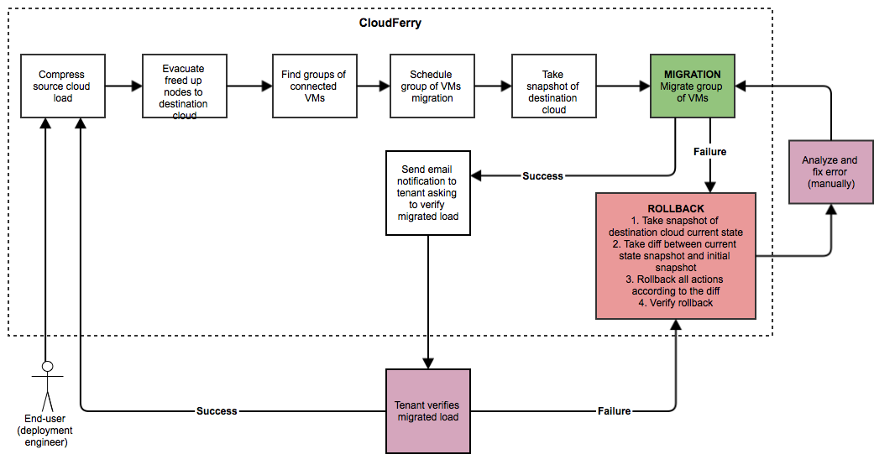

Migration
---------

Migration in the context of CloudFerry focuses on whole Tenants rather than
Tenant resources. Migration refers to moving an entire tenant from one OpenStack
Cloud to another. That includes workloads as well as resources. It is the
last stage in the process and uses the work done during Condensation and
Evacuation. Many of the same challenges encountered with Evacuation activities
are found when migrating as well as many others specific to migration. The
difficulty, time involved and risk involved in manually migrating tenants
is significant and most organizations simply cannot tolerate that level
of risk. CloudFerry minimizes the risk partly by providing a scenario and
sticking to it and largely by keeping necessary human actions to a minimum.

Thanks to the use of layered configuration specificity CloudFerry is
highly flexible and can accommodate very complex migration requirements
and constraints. It should be noted that CloudFerry is a tool, not a magic
wand. Cloud operators who are undertaking migration activities will want to
make things as easy on themselves as possible at each phase of the project.
Thorough planning is still necessary even with the best tools available.
