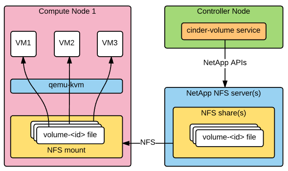
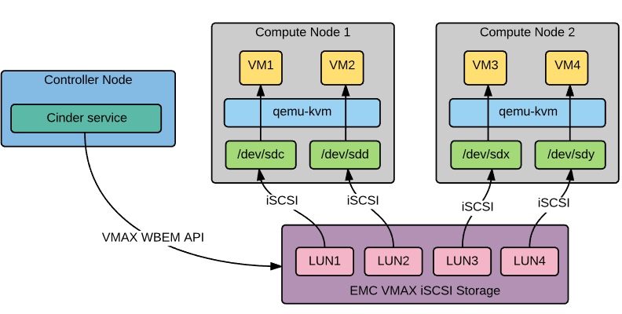

=========================
Cinder migration overview
=========================

Following Openstack cinder (block storage service) objects can be migrated
with CloudFerry:

 - volumes;
 - volume quotas.

.. warning::

    Volume snapshots and backups are not supported for migration by CloudFerry

Supported cinder plugins
------------------------

CloudFerry supports following cinder plugins:

 - NFS
    - `Generic NFS cinder driver <http://docs.openstack.org/admin-guide-cloud/blockstorage_nfs_backend.html>`_;
    - `NetApp NFS cinder driver <http://docs.openstack.org/liberty/config-reference/content/netapp-volume-driver.html>`_;
 - iSCSI
    - `EMC VMAX iSCSI cinder driver <http://docs.openstack.org/liberty/config-reference/content/emc-vmax-driver.html>`_.

NFS cinder plugin
^^^^^^^^^^^^^^^^^

Volumes are stored as regular files in NFS share which is mounted from NetApp
NFS server. Cinder supports multiple NFS mount points from multiple NFS servers
and then allocates volumes based on round-robin algorithm. NFS shares are
mounted by cinder service at initialization time.

EMC VMAX iSCSI cinder plugin
^^^^^^^^^^^^^^^^^^^^^^^^^^^^

Volumes are stored as LUN objects on VMAX storage nodes and are accessible
through WBEM APIs (`PyWBEM <http://pywbem.github.io/pywbem/index.html>`_) and
iSCSI. On volume attach event a block device ``/dev/sd*`` is created on compute
node which holds VM and then gets attached to VM over iSCSI.

Configuration
-------------

Primary configuration for cinder objects migration is located in
``[src_storage]`` and ``[dst_storage]`` sections of :ref:`primary-config-file`

Most important option is to select correct backend driver, which can be
specified in ``backend`` config option. Currently it allows two values:
``nfs`` and ``iscsi-vmax`` which correspond to NFS cinder driver (generic
or NetApp) and EMC VMAX iSCSI driver.

.. todo::

    Describe config options for EMC VMAX plugin

Migration process
-----------------

Migration process depends on cinder driver used in a cloud. Currently
following migrations are supported:

 - NFS to NFS;
 - NFS to iSCSI VMAX;

NFS to NFS migration process
^^^^^^^^^^^^^^^^^^^^^^^^^^^^

In case with NFS cinder volumes are regular files stored on compute nodes,
thus volume migration is pretty simple:

 - Create volume in destination cloud using cinder APIs;
 - Wait untill file corresponding to cinder volume gets created;
 - Copy volume file from source cloud to destination cloud using one of
   :ref:`copy-mechanisms`.

NFS to iSCSI VMAX migration process
^^^^^^^^^^^^^^^^^^^^^^^^^^^^^^^^^^^

This case is somewhat more complex, because it requires to copy regular
files into block devices created by VMAX. This is done with standard unix
``dd`` utility:

 - Create volume in destination using cinder APIs;
 - Identify file corresponding to a volume in source cloud;
 - Add VMAX volume to a masking view [#masking-view]_;
 - Attach volume to a node CloudFerry is running on over iSCSI protocol;
 - Copy volume data from source volume file into destination volume block
   device using ``dd`` utility over SSH.

.. rubric:: Footnotes

.. [#masking-view] Masking view is VMAX-specific container which allows
    discovery of volumes over iSCSI.
